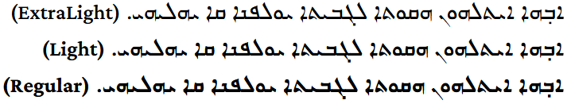

The Idiqlat font supports the East Syriac style of the Syriac script. The original font on which Idiqlat was based was an [OFL](https://openfontlicense.org/)-licensed typeface called **East Syriac Marcus**, designed as a revival of metal type. However, significant design changes have been made in order to modernize and opitimize the font for web and mobile use. The Latin letters are a subset of the [Crimson Pro](https://github.com/Fonthausen/CrimsonPro) font.

Three fonts from this typeface family are included in the *Idiqlat* release:

* Idiqlat ExtraLight
* Idiqlat Light
* Idiqlat Regular

## Type Samples

Type samples showing some of the inventory of glyphs can be found here: 
[Idiqlat Type Sample](sample.md).

Examples of some text is shown below. 

{.fullsize}
<!-- PRODUCT SITE IMAGE SRC https://software.sil.org/idiqlat/wp-content/uploads/sites/76/2025/10/three-weights.png -->
<figcaption>Idiqlat Sample - Three weights</figcaption>

{.fullsize}
<!-- PRODUCT SITE IMAGE SRC https://software.sil.org/idiqlat/wp-content/uploads/sites/76/2025/10/IdiqlatGen11.png -->
<figcaption>Idiqlat Sample - Genesis 11</figcaption>

## Character Set

For a complete list of characters included in this font, see [Character Set Support](charset.md).

## Font Features

Alternate glyphs that are available through features are demonstrated in the [Features](features.md) document. 

SIL Global is the creator of the Idiqlat fonts, and is the owner of all proprietary rights therein.

*Idiqlat* is a trademark of SIL Global.